# 📊 Portfolio Risk & Performance Analyzer

## ✅ Overview
The **Portfolio Risk & Performance Analyzer** is a Python-based tool for evaluating the **risk-return characteristics** of financial assets over multiple time horizons. It calculates key metrics such as **Mean Log Return, Volatility, Value at Risk (VaR), Expected Shortfall (ES), CAGR, Max Drawdown, and Calmar Ratio**, and visualizes them using **Seaborn and Matplotlib**.

---

## 🚀 Features
✔ Compute **log returns** and risk metrics for multiple holding periods  
✔ Calculate **VaR & ES** at different confidence levels  
✔ Derive **CAGR, Max Drawdown, and Calmar Ratio**  
✔ Generate **visual reports**:  
  - Mean Return & Volatility  
  - VaR & ES trends  
  - CAGR vs Drawdown comparison  
  - Correlation heatmap  
  - Log return distributions  
  - Cumulative returns over time  
✔ Save **all plots locally**  
✔ Export statistics to **CSV** 

---

## 📐 Mathematical Formulas for Metrics

- **Mean Log Return:**
  $$
  r_t = \ln\left( \frac{P_t}{P_{t-1}} \right), \quad
  \bar{r} = \frac{1}{n} \sum_{t=1}^{n} r_t
  $$

- **Standard Deviation:**
  $$
  \sigma = \sqrt{ \frac{1}{n-1} \sum_{t=1}^{n} (r_t - \bar{r})^2 }, \quad
  \sigma_{\text{annual}} = \sigma_{\text{daily}} \times \sqrt{k}
  $$

- **Value at Risk (VaR):**
  $$
  \text{VaR}_{\alpha} = \text{Quantile}_{(1-\alpha)}(r_t)
  $$

- **Expected Shortfall (ES):**
  $$
  \text{ES}_{\alpha} = \mathbb{E}[ r_t \;|\; r_t \leq \text{VaR}_{\alpha} ]
  $$

- **Compound Annual Growth Rate (CAGR):**
  $$
  \text{CAGR} = \left( \frac{P_n}{P_0} \right)^{\frac{1}{T}} - 1
  $$

- **Maximum Drawdown (MDD):**
  $$
  \text{MDD} = \min_{t} \left( \frac{P_t}{\max_{s \le t} P_s} - 1 \right)
  $$

- **Calmar Ratio:**
  $$
  \text{Calmar Ratio} = \frac{\text{CAGR}}{\left|\text{Max Drawdown}\right|}
  $$

---

## Visualizations
✅ 1. Mean Log Return across Intervals

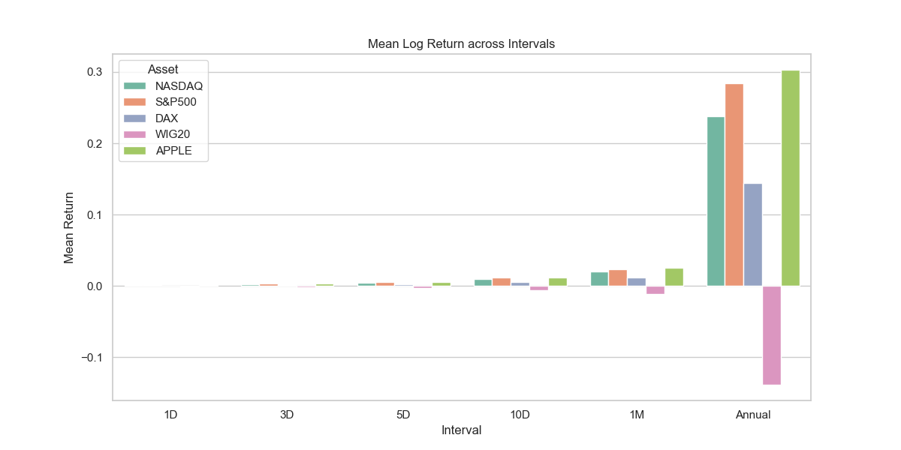

This bar chart compares the average log returns of each asset across different holding intervals (1D, 3D, 5D, 10D, 1M, Annual). It provides insights into the expected return behavior of assets over short and long horizons.

✅ 2. Standard Deviation across Intervals 

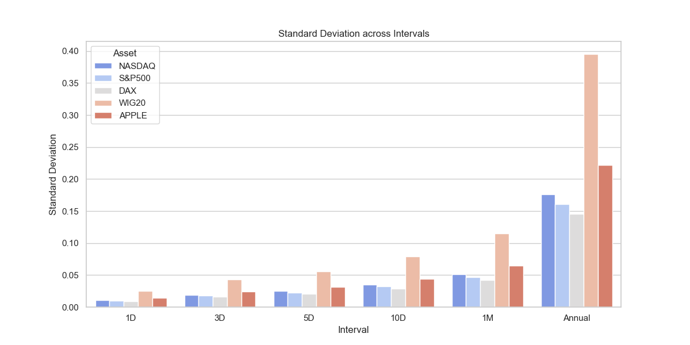

This bar chart shows the volatility (risk) of each asset across multiple intervals. Higher standard deviation indicates higher price fluctuations, which means higher uncertainty or risk.

✅ 3. VaR & ES (95%) across Intervals 

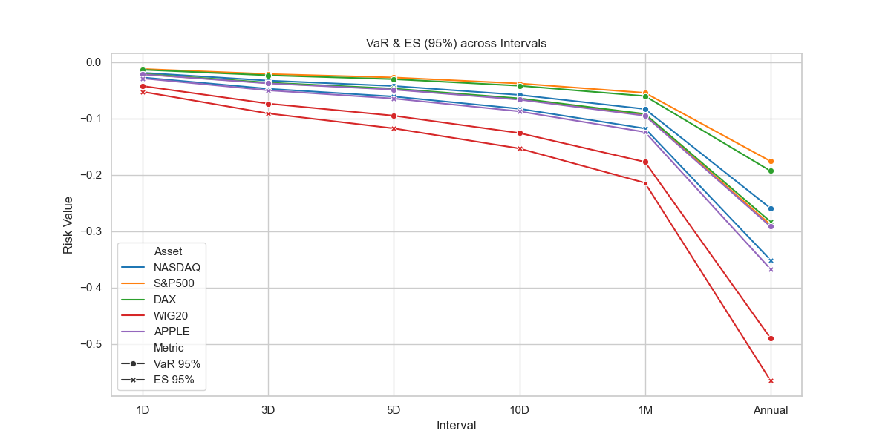

This line chart visualizes Value at Risk (VaR) and Expected Shortfall (ES) at the 95% confidence level for each interval.

VaR estimates the maximum expected loss under normal conditions.

ES measures the average loss beyond the VaR threshold (tail risk).

✅ 4. CAGR and Max Drawdown across Intervals

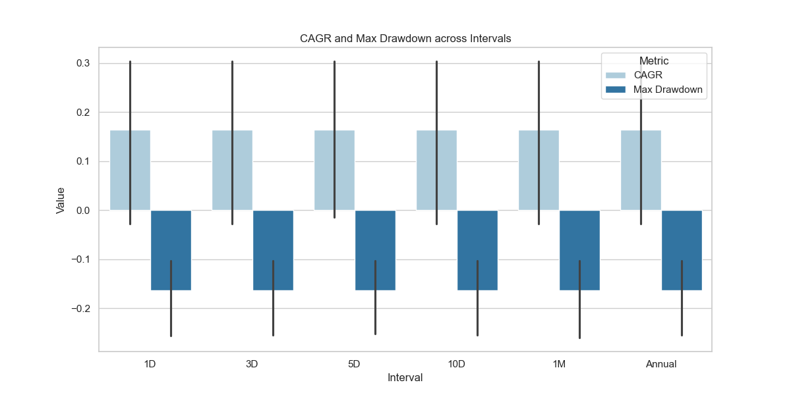

This bar chart compares Compound Annual Growth Rate (CAGR) and Maximum Drawdown:

CAGR shows the annualized growth rate of the asset.

Max Drawdown indicates the worst peak-to-trough decline, representing downside risk.

✅ 5. Correlation Heatmap

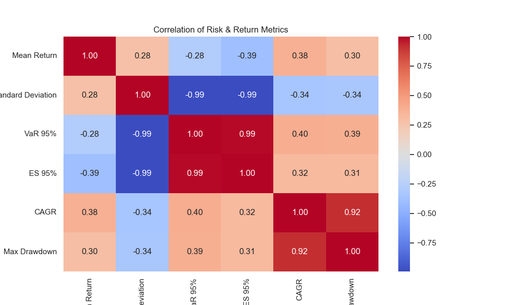

This heatmap displays the correlation matrix between key metrics (Mean Return, Standard Deviation, VaR, ES, CAGR, Max Drawdown). It helps identify relationships between risk and return measures.

✅ 6. Distribution of Daily Log Returns

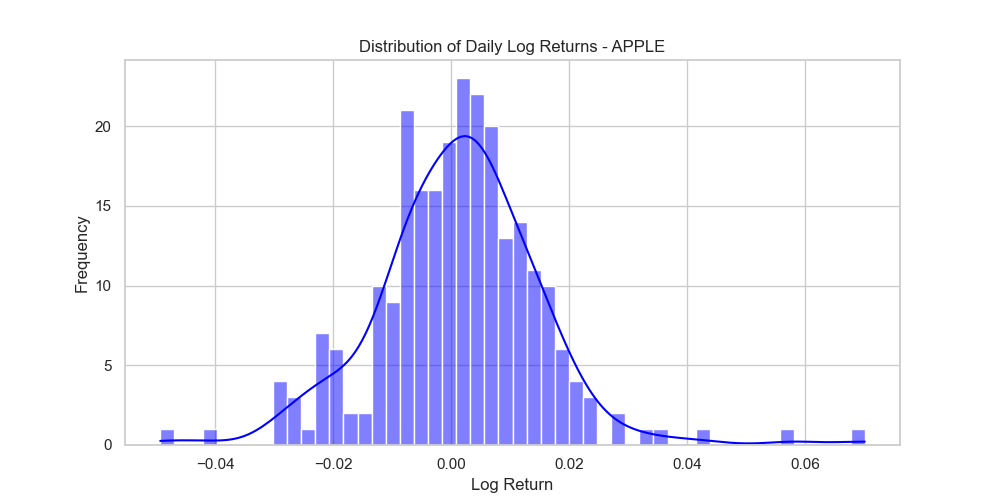
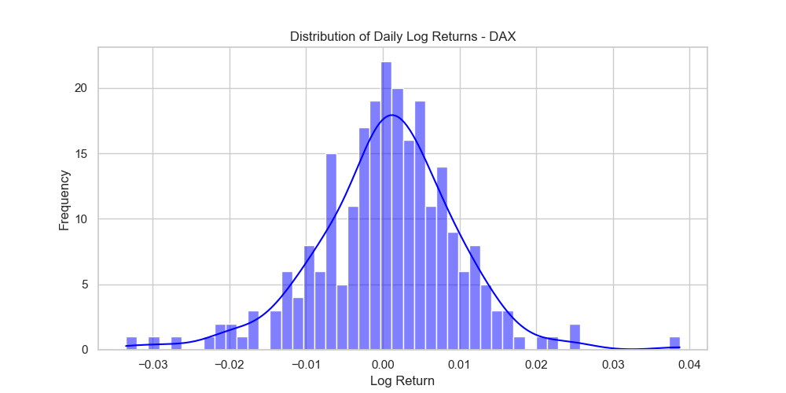
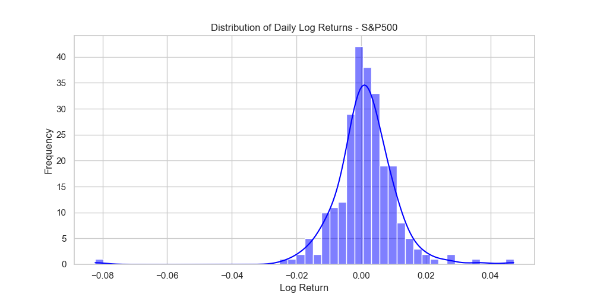
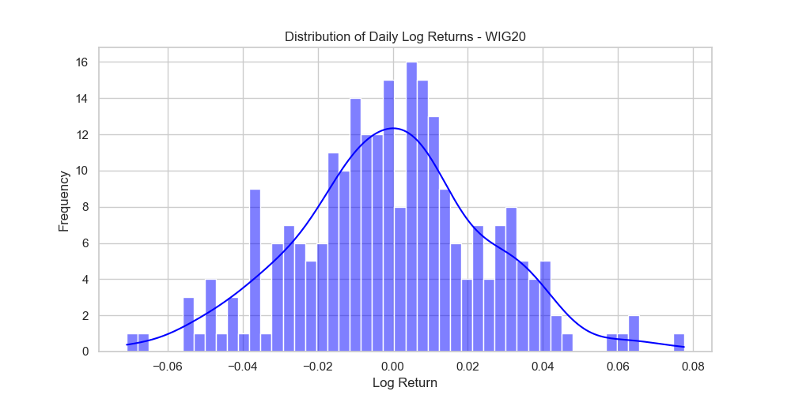
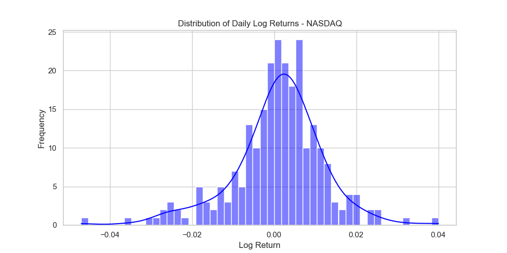

For each asset, this histogram with KDE (Kernel Density Estimate) shows the distribution of daily log returns. It provides insights into skewness, kurtosis, and potential fat tails, which indicate extreme events.

✅ 7. Cumulative Returns Over Time

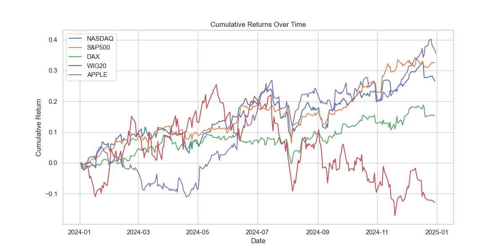
This time-series chart plots the cumulative returns for each asset starting from the same base date. It helps compare long-term performance and identify trends or market cycles.

